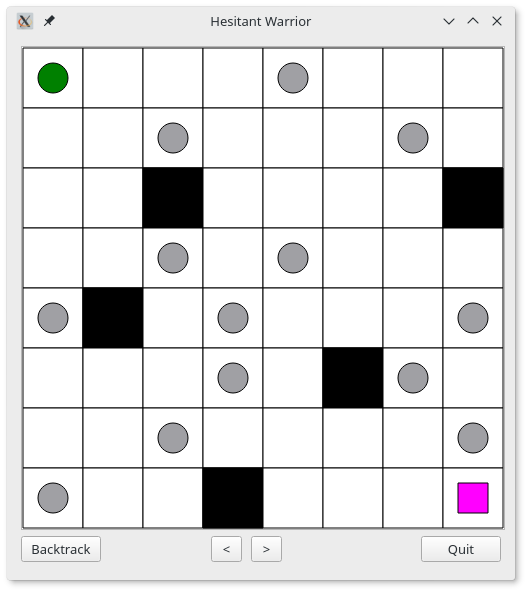

# Hesitant Warrior

A labyrinth solving AI problem. Solved with various algorithms: Backtrack, DFS, BFS, A-Algorithm.

 The aim is to move our player(green circle) to the finishing point(pink square). The rules are
the following:
- The player can move horizontally and vertically.
- In each step, it is mandatory to move 2 or 3 cell long distance.
- The player starts with step size: 2 cells.
- The step size can only change if the player moves to a cell marked by a circle. Then if the step
size was 2 it changes to 3, if it was 3 it changes to 2.
- The player cannot step on any of the black cells.

The reason I gave this name to the project is the player is not moving in stable distance, he's hesitant.

Taha İbrahim BAYRAM
